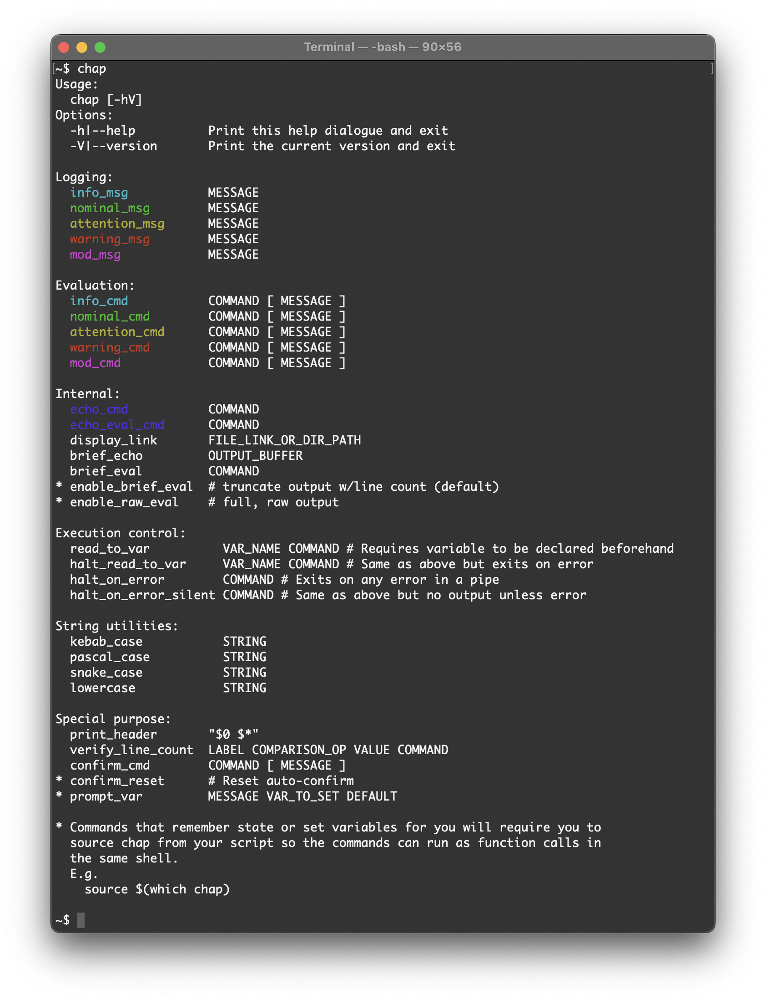

# chap

Utility scripting methods for humans. 

- Display messages and commands to the user color coded to various levels of 
  importance.
- Auto echo the command to be executed for quick manual debugging when needed.
- Confirm command with skip, auto-confirm, and execution time features
- Evaluate commands with truncated output so you can get a brief idea of what 
  a command is doing without having to dump a wall of text.
- Automatically checks for links and displays their target along side them
- A basic header


# Requirements
- bash 4 or greater

# Install

Available as a [bpkg](http://www.bpkg.sh/)
```sh
bpkg install [-g] kirtfitzpatrick/chap
```

# Usage


# Demo

